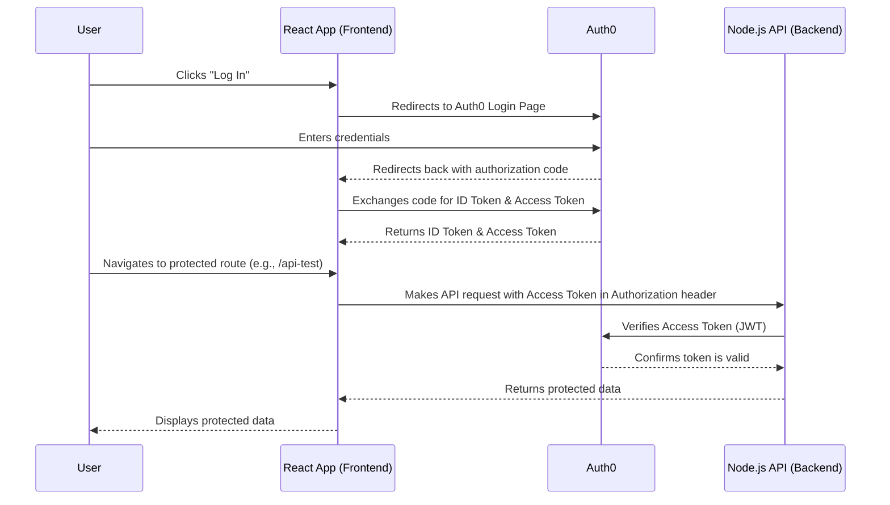

# Full-Stack Auth0 Tutorial: React and Node.js

This tutorial will guide you through setting up a full-stack application with secure authentication and authorization using Auth0. The frontend will be a React SPA, and the backend will be a Node.js/Express API.

## Part 1: Auth0 Dashboard Configuration

Before we write any code, we need to configure our applications and API in the Auth0 dashboard.

### 1. Create a New Auth0 Tenant

If you don't have an Auth0 account, [sign up for a free one](https://auth0.com/signup). When you sign up, you create a "tenant," which is your dedicated space in the Auth0 service. Your tenant domain will look something like `your-tenant-name.us.auth0.com`. This domain is important, as we'll use it in both our frontend and backend applications.

### 2. Create a Single Page Application (SPA) for the React Client

This represents your React application.

1.  Navigate to **Applications -> Applications** in your Auth0 dashboard and click **Create Application**.
2.  Give your application a name (e.g., "React SPA") and select **Single Page Web Applications**.
3.  Click **Create**.
4.  Once created, go to the **Settings** tab. You will need the **Domain** and **Client ID**. Keep these values handy.

### 3. Configure Application URIs

In the same **Settings** tab for your SPA, you need to configure the URLs that Auth0 will use to interact with your application.

*   **Allowed Callback URLs**: This is where Auth0 will redirect users after they successfully log in. For local development, this is typically `http://localhost:5173`.
*   **Allowed Logout URLs**: This is where Auth0 will redirect users after they log out. For local development, this is also typically `http://localhost:5173`.
*   **Allowed Web Origins**: This is the URL that is allowed to make requests to the Auth0 authentication API. For local development, this is `http://localhost:5173`.

*Note: If you are using a different port for your React development server, adjust the port number accordingly.*

### 4. Create an API for the Node.js Backend

This represents your Node.js API that you want to protect.

1.  Navigate to **Applications -> APIs** in your Auth0 dashboard and click **Create API**.
2.  Give your API a name (e.g., "My Express API").
3.  Set the **Identifier**. This is a unique string that identifies your API. It's often in the form of a URL, but it doesn't have to be a publicly accessible URL (e.g., `https://api.my-app.com`). This is also known as the **Audience**.
4.  Leave the signing algorithm as **RS256**.
5.  Click **Create**.

### 5. Configure API Permissions (Scopes)

Scopes represent the permissions that can be granted to access your API's resources.

1.  In your newly created API's settings, go to the **Permissions** tab.
2.  You can define custom scopes here if your API has different levels of access (e.g., `read:messages`, `write:messages`). For this tutorial, we will not add custom scopes, but it's good to know where they are.

You have now completed the Auth0 dashboard setup. You should have the following values ready:

*   **From your SPA Application:**
    *   Domain
    *   Client ID
*   **From your API:**
    *   API Identifier (Audience)

Keep these values safe and ready for the next steps.

## Part 2: Backend (Node.js/Express) Implementation

Now, let's set up the backend API.

### 1. Install Dependencies

Navigate to your `backend` directory and run the following command to install the necessary packages:

```bash
npm install express cors express-oauth2-jwt-bearer
```

*   `express`: The web framework for Node.js.
*   `cors`: A middleware to enable Cross-Origin Resource Sharing, which is necessary for your React app to communicate with the API.
*   `express-oauth2-jwt-bearer`: The Auth0 middleware that will validate the JSON Web Tokens (JWTs) sent from the frontend.

### 2. Create the Server

Replace the content of your `backend/index.js` file with the following code:

```javascript
const express = require('express');
const cors = require('cors');
const { auth } = require('express-oauth2-jwt-bearer');

const app = express();
const port = 3001;

// Enable CORS
app.use(cors());

// JWT validation middleware
const checkJwt = auth({
  audience: 'YOUR_API_IDENTIFIER', // Replace with your API Identifier from Auth0
  issuerBaseURL: `https://YOUR_AUTH0_DOMAIN/`, // Replace with your Auth0 Domain
});

// Public endpoint (no authentication required)
app.get('/api/public', (req, res) => {
  res.json({
    message: "Hello from a public endpoint! You don't need to be authenticated to see this."
  });
});

// Protected endpoint (requires a valid access token)
app.get('/api/private', checkJwt, (req, res) => {
  res.json({
    message: 'Hello from a private endpoint! You need to be authenticated to see this.'
  });
});

app.listen(port, () => {
  console.log(`Server listening on port ${port}`);
});
```

### 3. Understanding the Code

*   **`checkJwt` Middleware**: This is the core of our API protection. The `auth()` function from `express-oauth2-jwt-bearer` is configured with your Auth0 **Domain** and API **Identifier (Audience)**. When a request comes to a protected route, this middleware will check for a valid JWT in the `Authorization` header. If the token is valid, it will pass the request to the route handler. If not, it will return a 401 Unauthorized error.
*   **Public vs. Private Endpoints**:
    *   The `/api/public` route does not use the `checkJwt` middleware, so anyone can access it.
    *   The `/api/private` route *does* use the `checkJwt` middleware, so only authenticated users with a valid access token can access it.

**IMPORTANT**: Remember to replace `YOUR_API_IDENTIFIER` and `YOUR_AUTH0_DOMAIN` with the actual values from your Auth0 dashboard. We will later move these to environment variables for better security.

## Part 3: Frontend (React) Implementation

With the backend ready, let's implement the frontend authentication logic.

### 1. Install Dependencies

Navigate to your `frontend` directory and run this command:

```bash
npm install @auth0/auth0-react react-router-dom
```

*   `@auth0/auth0-react`: The official Auth0 SDK for React.
*   `react-router-dom`: For handling routing in our application.

### 2. Configure the Auth0Provider

The `Auth0Provider` component provides the authentication context to your entire application. We need to wrap our root component (`App`) with it.

Modify your `frontend/src/main.tsx` file to look like this:

```typescript
import { StrictMode } from 'react';
import { createRoot } from 'react-dom/client';
import { BrowserRouter } from 'react-router-dom';
import { Auth0Provider } from '@auth0/auth0-react';
import App from './App.tsx';
import './index.css';

createRoot(document.getElementById('root')!).render(
  <StrictMode>
    <BrowserRouter>
      <Auth0Provider
        domain="YOUR_AUTH0_DOMAIN"
        clientId="YOUR_CLIENT_ID"
        authorizationParams={{
          redirect_uri: window.location.origin,
          audience: "YOUR_API_IDENTIFIER",
        }}
      >
        <App />
      </Auth0Provider>
    </BrowserRouter>
  </StrictMode>,
);
```

### 3. Understanding the `Auth0Provider` Configuration

*   **`domain`**: The **Domain** from your Auth0 SPA Application settings.
*   **`clientId`**: The **Client ID** from your Auth0 SPA Application settings.
*   **`authorizationParams.redirect_uri`**: The URL where users will be redirected after logging in. `window.location.origin` conveniently uses the base URL of your application.
*   **`authorizationParams.audience`**: The **Identifier** of the API you created in Auth0. This is crucial for getting an access token that your backend API will accept.

**IMPORTANT**: Remember to replace `YOUR_AUTH0_DOMAIN`, `YOUR_CLIENT_ID`, and `YOUR_API_IDENTIFIER` with your actual Auth0 credentials. We will move these to environment variables later.

### 4. Create UI Components

Let's create the components for logging in, logging out, and displaying the user's profile.

Create a new directory `frontend/src/components`. Inside this directory, create the following three files:

**`frontend/src/components/LoginButton.tsx`**
```typescript
import { useAuth0 } from '@auth0/auth0-react';

const LoginButton = () => {
  const { loginWithRedirect } = useAuth0();

  return <button onClick={() => loginWithRedirect()}>Log In</button>;
};

export default LoginButton;
```

**`frontend/src/components/LogoutButton.tsx`**
```typescript
import { useAuth0 } from '@auth0/auth0-react';

const LogoutButton = () => {
  const { logout } = useAuth0();

  return (
    <button onClick={() => logout({ logoutParams: { returnTo: window.location.origin } })}>
      Log Out
    </button>
  );
};

export default LogoutButton;
```

**`frontend/src/components/Profile.tsx`**
```typescript
import { useAuth0 } from '@auth0/auth0-react';

const Profile = () => {
  const { user, isAuthenticated, isLoading } = useAuth0();

  if (isLoading) {
    return <div>Loading ...</div>;
  }

  return (
    isAuthenticated && (
      <div>
        
        <h2>{user?.name}</h2>
        <p>{user?.email}</p>
      </div>
    )
  );
};

export default Profile;
```

### 5. Update the Main App Component

Now, let's bring it all together in `frontend/src/App.tsx`. This file will serve as the main entry point for our UI, handling routing and conditionally displaying components based on the user's authentication state.

```typescript
import { Routes, Route, Link } from 'react-router-dom';
import { useAuth0 } from '@auth0/auth0-react';
import LoginButton from './components/LoginButton';
import LogoutButton from './components/LogoutButton';
import Profile from './components/Profile';
import './App.css';

function App() {
  const { isAuthenticated } = useAuth0();

  return (
    <>
      <nav>
        <Link to="/">Home</Link>
        {isAuthenticated && <Link to="/profile">Profile</Link>}
      </nav>
      {isAuthenticated ? <LogoutButton /> : <LoginButton />}
      <Routes>
        <Route path="/" element={<h1>Home</h1>} />
        <Route path="/profile" element={<Profile />} />
      </Routes>
    </>
  );
}

export default App;
```

At this point, you should be able to run your React application, log in with Auth0, see your profile information, and log out.

### 6. Implement Protected Routes

To prevent unauthenticated users from accessing certain parts of our application (like the profile page), we'll create a protected route component.

Create a new file: **`frontend/src/components/ProtectedRoute.tsx`**

```typescript
import { withAuthenticationRequired } from '@auth0/auth0-react';
import type { ComponentType } from 'react';

interface ProtectedRouteProps {
  component: ComponentType;
}

export const ProtectedRoute = ({ component }: ProtectedRouteProps) => {
  const Component = withAuthenticationRequired(component, {
    onRedirecting: () => <div>Loading...</div>,
  });

  return <Component />;
};
```

This component uses the `withAuthenticationRequired` HOC from the Auth0 SDK. If a user tries to access a component wrapped in this HOC without being authenticated, they will be redirected to the Auth0 login page.

Now, update `frontend/src/App.tsx` to use this `ProtectedRoute` for the `/profile` route:

```typescript
import { Routes, Route, Link } from 'react-router-dom';
import { useAuth0 } from '@auth0/auth0-react';
import LoginButton from './components/LoginButton';
import LogoutButton from './components/LogoutButton';
import Profile from './components/Profile';
import { ProtectedRoute } from './components/ProtectedRoute';
import './App.css';

function App() {
  const { isAuthenticated } = useAuth0();

  return (
    <>
      <nav>
        <Link to="/">Home</Link>
        {isAuthenticated && <Link to="/profile">Profile</Link>}
      </nav>
      {isAuthenticated ? <LogoutButton /> : <LoginButton />}
      <Routes>
        <Route path="/" element={<h1>Home</h1>} />
        <Route path="/profile" element={<ProtectedRoute component={Profile} />} />
      </Routes>
    </>
  );
}

export default App;
```

## Part 4: Connecting Frontend and Backend

Now, let's create a component to test the connection to our backend API. This will demonstrate how to call both public and protected endpoints.

### 1. Create an API Test Component

Create a new file: **`frontend/src/components/ApiTest.tsx`**

```typescript
import { useState } from 'react';
import { useAuth0 } from '@auth0/auth0-react';

const ApiTest = () => {
  const [publicMessage, setPublicMessage] = useState('');
  const [privateMessage, setPrivateMessage] = useState('');
  const { getAccessTokenSilently } = useAuth0();

  const getPublicMessage = async () => {
    try {
      const response = await fetch('http://localhost:3001/api/public');
      const data = await response.json();
      setPublicMessage(data.message);
    } catch (error) {
      console.error(error);
      setPublicMessage('Error fetching public message.');
    }
  };

  const getPrivateMessage = async () => {
    try {
      const token = await getAccessTokenSilently();
      const response = await fetch('http://localhost:3001/api/private', {
        headers: {
          Authorization: `Bearer ${token}`,
        },
      });
      const data = await response.json();
      setPrivateMessage(data.message);
    } catch (error)
    {
      console.error(error);
      setPrivateMessage('Error fetching private message.');
    }
  };

  return (
    <div>
      <h1>API Test</h1>
      <div>
        <button onClick={getPublicMessage}>Get Public Message</button>
        <p>{publicMessage}</p>
      </div>
      <div>
        <button onClick={getPrivateMessage}>Get Private Message</button>
        <p>{privateMessage}</p>
      </div>
    </div>
  );
};

export default ApiTest;
```

### 2. Understanding the `ApiTest` Component

*   **`getPublicMessage`**: This function makes a simple `fetch` request to the `/api/public` endpoint on our backend. No special headers are needed.
*   **`getPrivateMessage`**: This is where the magic happens.
    *   `getAccessTokenSilently()`: This asynchronous function from the `useAuth0` hook retrieves the user's access token. The "silently" part means it will try to get the token without requiring user interaction (e.g., by using a cached token).
    *   **`Authorization` Header**: The retrieved token is then included in the `Authorization` header of the `fetch` request, with the `Bearer` scheme. This is how our backend API will know that the request is authenticated.

### 3. Add the API Test Route

Finally, let's add a link and a route for our new `ApiTest` component in `frontend/src/App.tsx`.

```typescript
import { Routes, Route, Link } from 'react-router-dom';
import { useAuth0 } from '@auth0/auth0-react';
import LoginButton from './components/LoginButton';
import LogoutButton from './components/LogoutButton';
import Profile from './components/Profile';
import { ProtectedRoute } from './components/ProtectedRoute';
import ApiTest from './components/ApiTest';
import './App.css';

function App() {
  const { isAuthenticated } = useAuth0();

  return (
    <>
      <nav>
        <Link to="/">Home</Link>
        {isAuthenticated && <Link to="/profile">Profile</Link>}
        {isAuthenticated && <Link to="/api-test">API Test</Link>}
      </nav>
      {isAuthenticated ? <LogoutButton /> : <LoginButton />}
      <Routes>
        <Route path="/" element={<h1>Home</h1>} />
        <Route path="/profile" element={<ProtectedRoute component={Profile} />} />
        <Route path="/api-test" element={<ProtectedRoute component={ApiTest} />} />
      </Routes>
    </>
  );
}

export default App;
```

## Part 5: Environment Variables and Security Best Practices

Hardcoding sensitive information like Auth0 credentials directly into your code is a security risk. The best practice is to use environment variables.

### 1. Backend (`.env`)

In your `backend` directory, create a file named `.env` and add your Auth0 API credentials:

**`backend/.env`**
```
AUTH0_AUDIENCE=YOUR_API_IDENTIFIER
AUTH0_ISSUER_BASE_URL=https://YOUR_AUTH0_DOMAIN/
```

To load these variables, we'll use the `dotenv` package. Install it by running `npm install dotenv` in your `backend` directory.

Then, add `require('dotenv').config();` to the very top of your `backend/index.js` file. Your `checkJwt` configuration should now look like this:

```javascript
const checkJwt = auth({
  audience: process.env.AUTH0_AUDIENCE,
  issuerBaseURL: process.env.AUTH0_ISSUER_BASE_URL,
});
```

### 2. Frontend (`.env`)

For the React app (created with Vite), you can create a `.env` file in the `frontend` directory. Vite will automatically load environment variables from this file if they are prefixed with `VITE_`.

**`frontend/.env`**
```
VITE_AUTH0_DOMAIN=YOUR_AUTH0_DOMAIN
VITE_AUTH0_CLIENT_ID=YOUR_CLIENT_ID
VITE_AUTH0_AUDIENCE=YOUR_API_IDENTIFIER
```

Now, update your `frontend/src/main.tsx` to use these variables:

```typescript
<Auth0Provider
  domain={import.meta.env.VITE_AUTH0_DOMAIN}
  clientId={import.meta.env.VITE_AUTH0_CLIENT_ID}
  authorizationParams={{
    redirect_uri: window.location.origin,
    audience: import.meta.env.VITE_AUTH0_AUDIENCE,
  }}
>
```

**IMPORTANT**: Remember to add `.env` to your `.gitignore` file in both the `frontend` and `backend` directories to avoid committing your secrets to version control.

### 3. Security Best Practices Summary

*   **Never expose secrets**: Always use environment variables for sensitive data.
*   **Configure CORS properly**: In a production environment, restrict the `cors` middleware to only allow requests from your frontend's domain.
*   **Use the `state` parameter**: The `auth0-react` SDK handles this for you, but it's good to know that the `state` parameter is used to prevent Cross-Site Request Forgery (CSRF) attacks.
*   **Keep dependencies updated**: Regularly update your dependencies to patch any security vulnerabilities.

## Authentication Flow Diagram

This diagram illustrates the authentication flow we are building.

